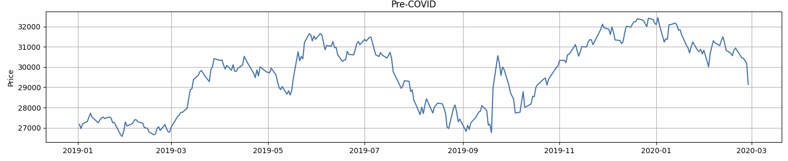
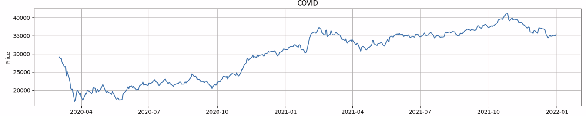
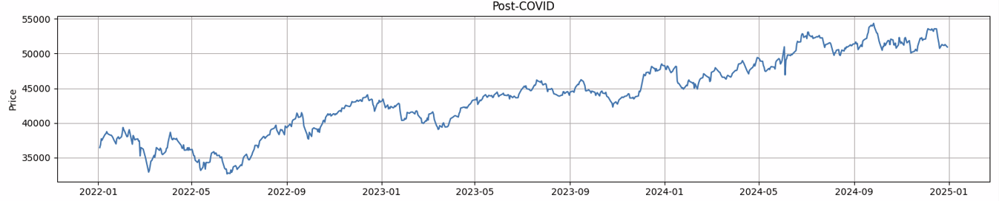

<div align="center">

# 📉 NIFTY Bank & COVID-19

**How the Indian banking sector collapsed, recovered, and hit new highs — all within 5 years.**

<br/>


</div>

<br/>

---

## What this is

A phase-by-phase analysis of the NIFTY Bank index through the COVID period. The goal wasn't just to confirm that COVID caused a crash — that part's obvious. It was to put hard numbers on *how fast* it fell, *how long* the chaos lasted, and what the recovery actually looked like.

The dataset is split into three phases:

| Phase | Period |
|:------|:-------|
| 🟡 Pre-COVID | Before March 2020 |
| 🔴 COVID | March 2020 – December 2021 |
| 🟢 Post-COVID | 2022 onwards |

---

## Snapshot

> A 42% wipeout in under a month. Then a 109% recovery. Then new all-time highs.

<br/>

<div align="center">

| Metric | Value |
|:---|:---:|
| COVID crash | **−41.96%** |
| Crash duration | **24 days** |
| Recovery (COVID phase) | **+109.73%** |
| Post-COVID growth | **+39.9%** |
| Above pre-COVID peak | **+67.6%** |

</div>

---

## Phase Breakdown

<br/>

### 🟡 Pre-COVID &nbsp;·&nbsp; *Slow grind, low noise*

```
Growth       +7.26%     Volatility   0.0126
Drawdown    -15.47%     Near Highs   70.67%     Up Days   49.82%
```

The index spent ~70% of its time near its peak — dips were shallow and bought quickly. Volatility at `0.0126` was low. Nothing remarkable, which is exactly the point: this is the baseline that makes everything that follows look so extreme.



<br/>

### 🔴 COVID &nbsp;·&nbsp; *Historic crash, historic bounce*

```
Crash        -41.96%    Duration     24 days
Recovery    +109.73%    Volatility   0.0225     Up Days   53.73%
```

Nearly 42% gone in 24 calendar days. Volatility doubled. For context — the 2008 crisis took months to produce similar damage; COVID did it in under four weeks.

The recovery was just as violent in the other direction. From the March 2020 low, the index more than doubled before the phase ended. Aggressive rate cuts, fiscal stimulus, and the realization that banks weren't facing a solvency crisis all contributed to the rebound.



<br/>

### 🟢 Post-COVID &nbsp;·&nbsp; *New highs, calmer than ever*

```
vs pre-COVID peak  +67.6%    Phase growth   +39.9%
Volatility          0.0110    Drawdown      -17.07%    Up Days   53.66%
```

By 2022 the index wasn't just recovered — it had structurally re-rated. Trading 67.6% above its pre-COVID peak, with volatility actually *below* the pre-COVID baseline (`0.011` vs `0.0126`). Corrections happened, but they were normal-sized and got bought.



---

## Conclusion

Three distinct market regimes, five years, one index.

The crash was fast and brutal. The recovery was faster than most expected. And the post-COVID period turned out quieter and stronger than the world the index came from. Whether that reflects genuine fundamental improvement in Indian banking or just a global liquidity tide is a fair debate — but the price behavior is clear.

External shocks can be violent. Sector fundamentals tend to win in the end.

---

## Running it

```bash
python analysis.py
```

Make sure your CSV (columns: `Date`, `Close`) is inside `data/` before running. Charts get written to `outputs/` automatically.

---

## Project structure

```
bank-nifty-covid/
│
├── data/            ← raw CSV from Yahoo Finance
├── phases/          ← phase-split datasets
├── outputs/         ← generated charts
│   ├── pre_covid.png
│   ├── covid.png
│   └── post_covid.png
│
├── analysis.py      ← core metrics + phase logic
└── graph.py         ← all plotting code
```